# 🔬 EV2A

> **Authors**: Haoqi Liu, Mehrdad Yaghoobi  
> the Institute for Imaging, Data and Communications, School of Engineering, University of Edinburgh, Edinburgh, U.K.

---

## 📖 Abstract

Visual microphones are designed to recover audio information from visual data acquired from camera sensors. There exist a few methods focusing on audio representation and reconstruction using filtering or optimization algorithms. However, because of the complexity of the sensing process, the overall performance of the visual microphones has been limited to date. In this paper, we propose to solve this problem with an end-to-end deep learning-based method using the event camera sensor, which only records the changes in light intensity. It is a more challenging problem, since the intensity changes are coarsely discretized, but it has its own practical benefits. We focus on the speech recovery task which requires high perceptual and objective quality to ensure the understandability of the output. The proposed model consists of architectures for the extraction of visual features and the enhancement of audio signals. It is trained and validated using real data with the paired speech and vibration recordings. The real data results demonstrate the improved recovery quality of the proposed method in objective metrics, achieving a Perceptual Evaluation of Speech Quality (PESQ) of 1.82 (range: -0.5 to 4.5) and a Short-Time Objective Intelligibility (STOI) of 0.80 (range: 0 to 1), representing improvements of 0.61 and 0.25, respectively, over state-of-the-art alternative methods. A downstream Speech-to-Text evaluation confirms the improved intelligible content recovery with a Character Error Rate (CER) of 0.17. Further experiments demonstrate the robustness of proposed method in terms of sensor's orientation, distance, and vibrating material.

  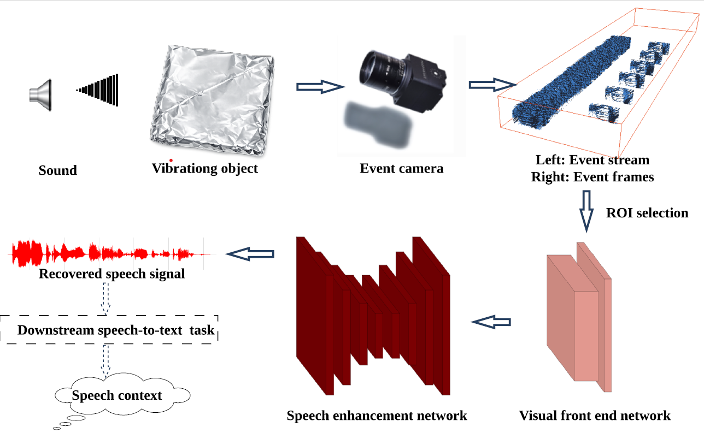
   
  <em>Fig1: Workflow of the Proposed Event Vibration to Audio (EV2A) Method</em>

---

## 🎯 Contributions

1. The first data-adaptive learning method for the task of speech recovery, building a direct mapping from visual vibration to high-resolution speech in an end-to-end training manner, is proposed here.
2. The designed ROI selection enables a further reduction in computation and memory, demonstrating that vibration information recorded in a $8\times8$ area is sufficient for speech recovery.
3. Comprehensive evaluations across objective metrics, STT downstream task, robustness analysis under diverse sensor conditions, and the vibrating-object experiment demonstrate the improved performance of the proposed method in terms of speech quality, content accuracy and generalization ability.

---

## 📊 Experiments Results

### Evaluation Metrics

| Method | PESQ ⬆ | STOI ⬆ | LSD ⬇ | WER ⬇ | CER ⬇ |
|:-----|:------:|:------:|:------:|:------:|:------:|
| VM | 1.21 | 0.55 | 3.67  | 0.83  | 0.52  |
| EBVM | 1.20 | 0.40 | 5.60 | 0.98  | 0.85  |
| **EV2A (Ours)** | **1.82** | **0.80** | **1.03** | **0.34** | **0.17** |

### Comparison of the Spectrograms

<table>
  <tr>
    <td align="center"><b>Ground Truth Spectrograms</b></td>
    <td align="center"><b>Recovered Speech From Vibration</b></td>
  </tr>
  <tr>
    <td>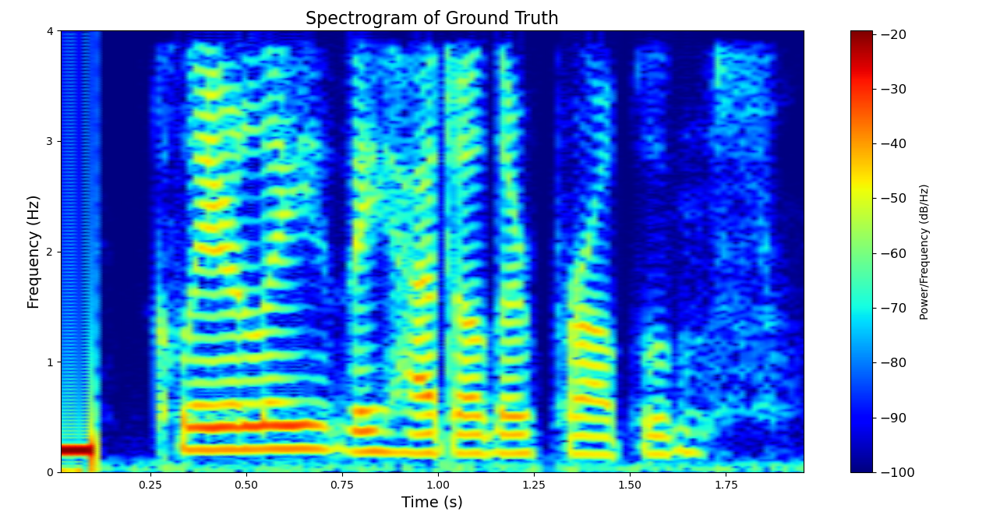</td>
    <td>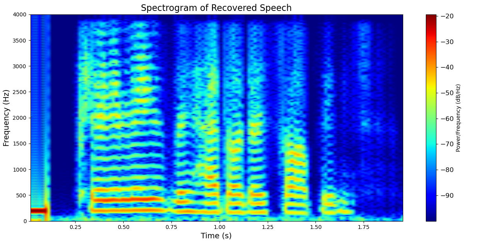</td>
  <tr>
    <td>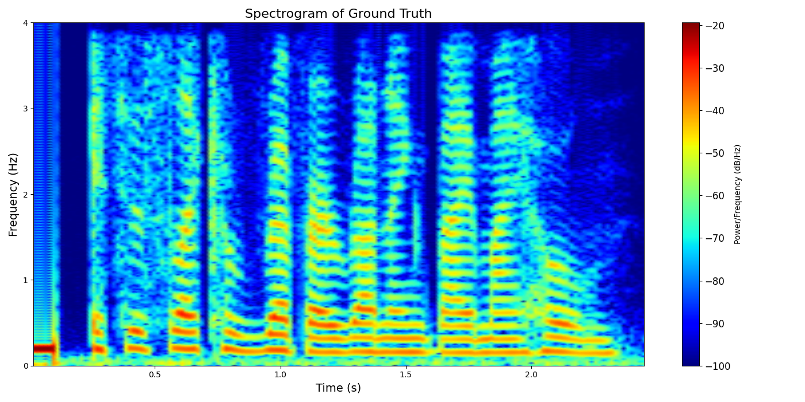</td>
    <td>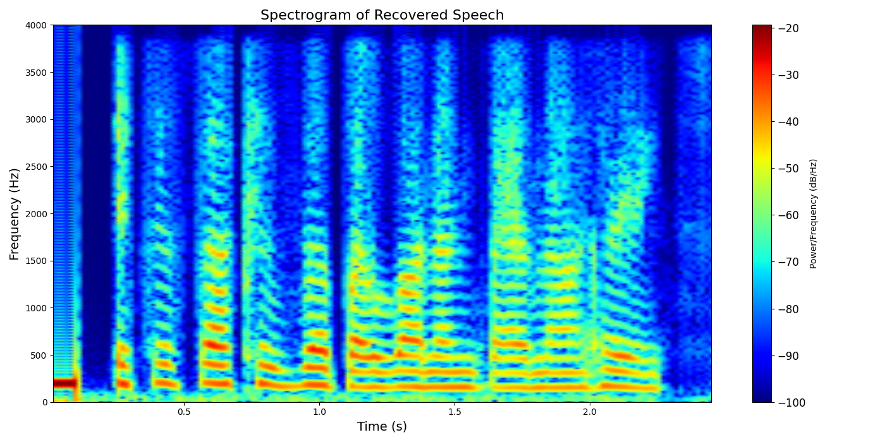</td>
  </tr>
  <tr>
    <td>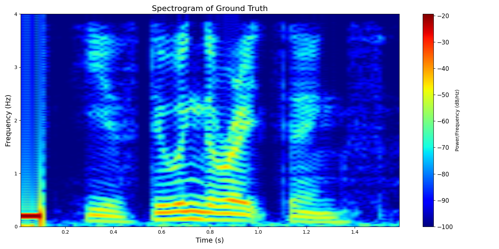</td>
    <td>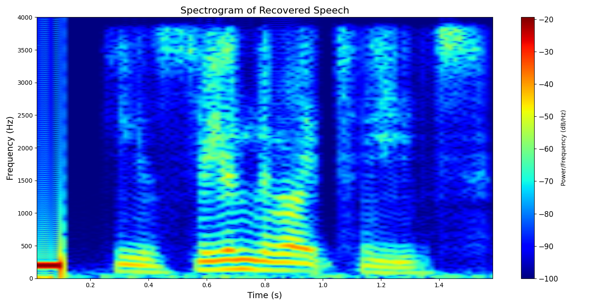</td>
  <tr>
    <tr>
    <td>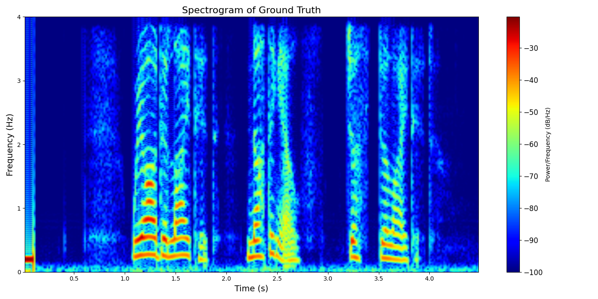</td>
    <td>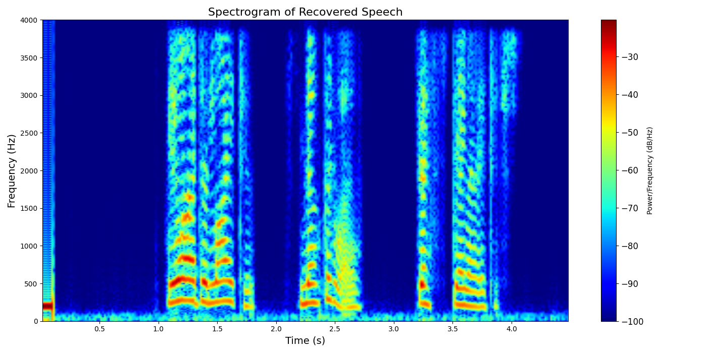</td>
  <tr>
</table>

<em>Fig2: Comparison of spectrogram between ground truth and recovered speech from event vibration recordings</em>

### Comparison of the Waveforms

<table>
  <tr>
    <td align="center"><b>Ground Truth Spectrograms</b></td>
    <td align="center"><b>Recovered Speech From Vibration</b></td>
  </tr>
  <tr>
    <td>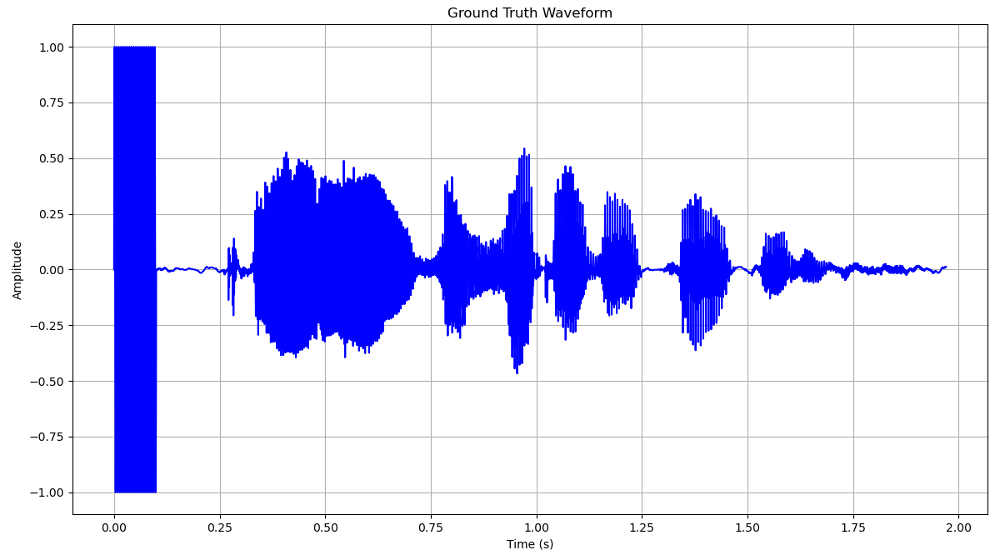</td>
    <td>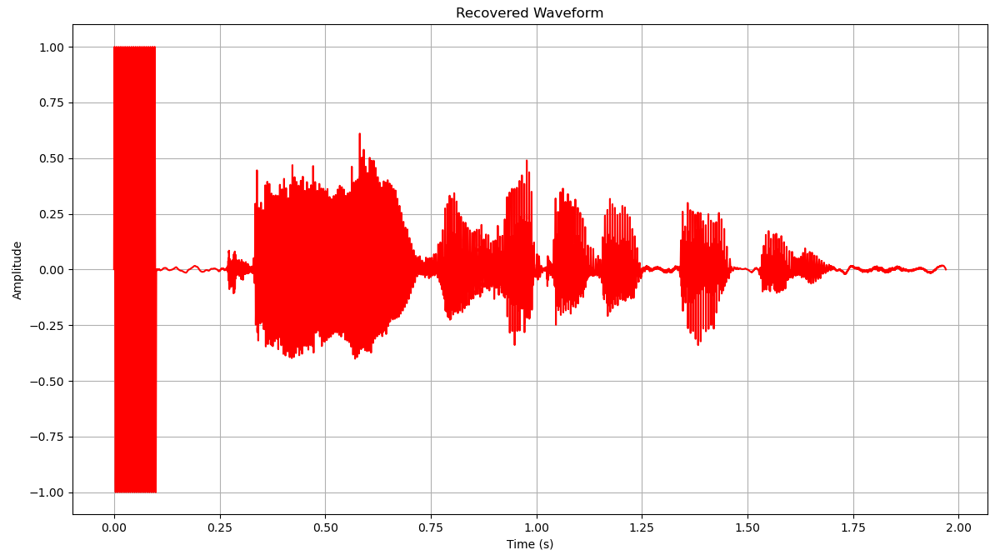</td>
  <tr>
    <td></td>
    <td></td>
  </tr>
</table>

<em>Fig3: Comparison of waveform between ground truth and recovered speech from event vibration recordings</em>

---

## 🎧 Audio Samples

We provide more audio samples in [Demo webpage](https://your-username.github.io/your-repo-name/)。

### Sample 1: Female Speaker

| Method | Audio |
|:-----|:-----|
| Ground Truth | [▶️ play](assets/audio/p234_196_mic1.wav) |
| **EV2A (ours)** | [▶️ play](assets/audio/p234_196_mic1_EV2A_2.wav) |
| VM | [▶️ play](assets/audio/p234_196_mic1_VM.wav) |

### Sample 2: Male Speaker

| Method | Audio |
|:-----|:-----|
| Ground Truth | [▶️ play](assets/audio/sample_002_noisy.wav) |
| **EV2A (ours)** | [▶️ play](assets/audio/sample_002_enhanced.wav) |
| VM | [▶️ play](assets/audio/sample_002_clean.wav) |

> ⚠️ **Notice**: GitHub doesn't support to direcly play the `.wav` file. Please download and play, or visit our webpage for listening: [ Demo webpage](https://your-username.github.io/your-repo-name/).

---

## 🎬 Vibration Recording Sample

  
   
  <em>点击图片跳转至 YouTube 观看完整演示</em>

###  Raw event stream data in XTT space

<!-- 方法1: 使用 GIF 动图（推荐用于短片段） -->

  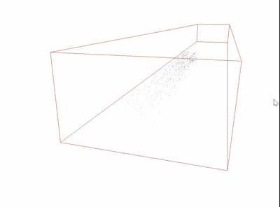
   
  <em>Fig4: An example of raw event data (Audio induced vibrating object) </em>

### Event frames after pre-processing

<!-- 方法1: 使用 GIF 动图（推荐用于短片段） -->

  
   
  <em>Fig5: An example of event frames data (Audio induced vibrating object) </em>

<!-- 方法2: 使用 GitHub 原生视频支持（推荐用于较长视频） -->

https://github.com/user-attachments/assets/your-video-hash-here

<em>视频1: 完整的实时语音增强演示</em>

---

## 🚀 Quik Start
Training code will be released when the paper gets accepted.

